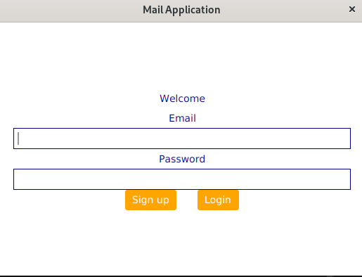
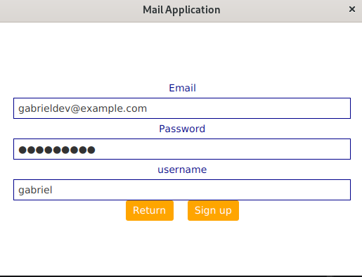
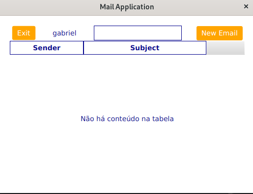
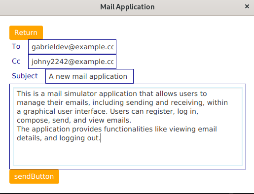
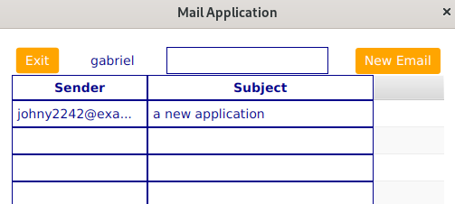

# Mail Simulator Application

## Overview
This is a mail simulator application that allows users to manage their emails, including sending and receiving, within a graphical user interface. Users can register, log in, compose, send, and view emails. The application provides functionalities like viewing email details, and logging out.

## Usage
1. Run the `HelloApplication` class to start the application.
2. Register and log in with existing credentials.
3. Compose and send emails to registered users.
4. View received emails and their details.
5. Log out to exit your account.

## Features
- User authentication system with registration and login functionalities.
- Graphical user interface for intuitive interaction.
- Compose and send emails to registered users.
- View received emails with details such as sender, subject, and content.

## Code Structure
- **`HelloApplication` class:** Entry point of the application, responsible for initializing the graphical interface.
- **`WindowView` class:** Handles the JavaFX window and scene setup.
- **`UserService` class:** Manages user-related operations such as registration, login, and user retrieval.
- **`UserRepository` class:** Handles user data storage and retrieval.
- **`User` class:** Represents a user with attributes like username, email, password, and email lists.
- **`Email` class:** Represents an email with sender, receiver, subject, content, and attachments.
- **`Contact` class:** Represents a contact with attributes like username and email.
- **`HelloController` class:** Controller for the main application window, handles user interactions and email management.
- **`EmailDetailController` class:** Controller for displaying email details in a separate window.

## Dependencies
- Java for run the application
- JavaFX for building graphical user interfaces.

## Notes
- Ensure proper error handling and input validation for production use.
- This readme serves as a quick reference; detailed documentation can be added as needed.

## Contributors
- [Gabriel]

## Application Screenshots

---

---

---

---

---
This readme is created based on the provided classes and descriptions. Let me know if there's anything else you'd like to add or modify!
